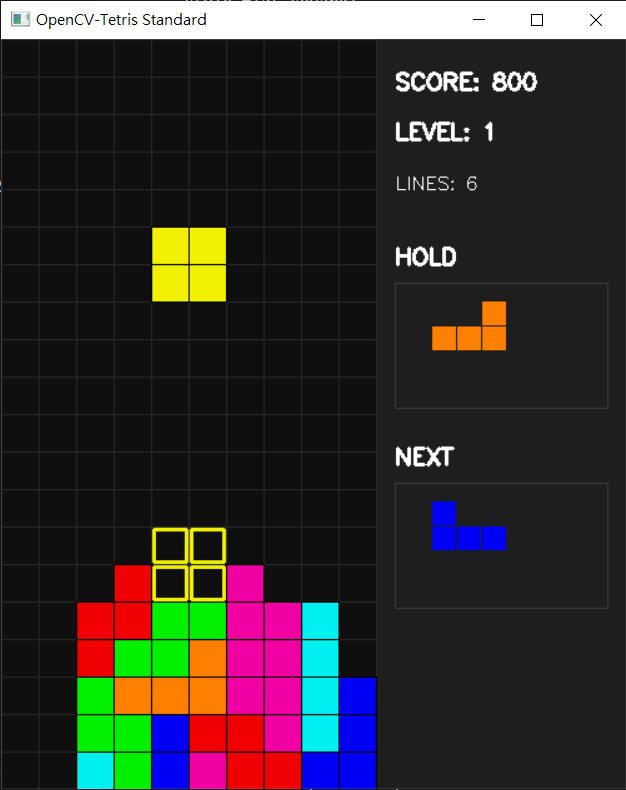

#  Tetris


一個基於 Python 與 OpenCV 實作的傳統俄羅斯方塊遊戲。程式架構區分為核心遊戲邏輯引擎與畫面渲染模組，導入了標準的 7-Bag 隨機抽樣演算法、SRS (Super Rotation System) 踢牆機制、影子方塊預覽以及暫存方塊功能。

## 功能特點

- **遊戲核心引擎**：獨立檔案，便於維護與後續擴充。
- **7-Bag 演算法**：確保方塊出現機率的隨機性與公平性。
- **SRS 踢牆機制**：方塊靠牆或在狹窄空間旋轉時的位移修正。
- **影子方塊**：預覽方塊落點。
- **Hold 功能**：每回合一次的方塊更換與暫存機制。
- **速度隨等級提升**：隨著消行數與分數增加。

## 檔案結構


```

├── config.py          # 遊戲參數、顏色、方塊及 SRS 查表
├── tetris_engine.py   # 核心邏輯、7-Bag、消行與旋轉判定
└── main.py            # OpenCV 渲染、主遊戲迴圈與鍵盤事件

```

## 環境需求

- Python 3.10
- OpenCV
- NumPy
- keyboard

## 安裝與執行說明

### 1. 安裝相依套件
請開啟終端機並執行以下指令安裝所需環境：
```bash
pip install opencv-python numpy keyboard
```

### 2. 執行遊戲

在專案根目錄下執行主程式：

```bash
python main.py
```


## 操作說明

| 按鍵 | 動作說明 |
| --- | --- |
| `A` / `D` 或 `←` / `→` | 左右移動方塊 |
| `W` / `↑` | 順時針旋轉方塊 (支援 SRS 踢牆) |
| `S` / `↓` | 軟降 (加速下落) |
| `Space`  | 硬降 (直接落鎖至底部) |
| `C` 或 `Shift` | 暫存方塊 (每回合一次) |
| `ESC` | 退出遊戲 |

## 技術細節說明

* **方塊矩陣與旋轉**：方塊採用 NumPy 矩陣進行 90 度旋轉操作。旋轉碰撞時，會依據當前的旋轉狀態代入 `config.py` 中的 SRS 踢牆表進行五個偏移點的逐一測試，直到找到合法的放置坐標，否則取消該次旋轉。
* **消行與計分系統**：每當偵測到整行填滿時，會進行消除並將上方的方塊矩陣向下平移。單次消除 1、2、3、4 行分別可獲得 100、300、500、800 的基礎積分加成。

## 遊戲實機
